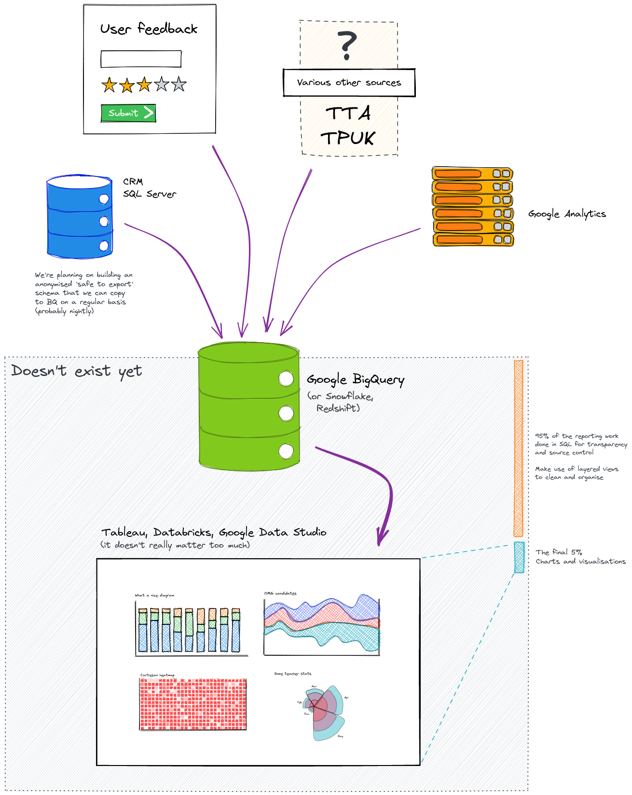

# Get Into Teaching reporting

This repository is a temporary place where we're gathering information and resources on building a better reporting system for GIT.

## Problems

* we have poor visibilty of data once we pass it on from GIT to the CRM
* there's no easy way for us to compare data from disparate sources
* the access to data we do have isn't easily shared among the team or wider through TWD

## Background

The two primary sources of data we want to report on are our raw data from the CRM and user data from Google Analytics. There are several others that will provide useful insight, including:

* feedback from various forms/questionnaries
* data from other related teams, including TTA, international recruitment, returners
* TPUK

We'll need to find the other data sources that contain information important to us and work out how to join it with our data, or update our processes so new data can be joined.

### Why analysing the CRM data using traditional methods isn't the right solution

The traditional methods don't give us much power or flexibilty. We have extremely limited access, cannot create database objects or access the report-writing functions from PowerBI. It's restictive because the CRM contains personally identifiable information.

We want to avoid the PII problem entirely and report only on safe data.

## The proposed solution

The following things need to be in place for our end-to-end reporting system to work.

1. **full access** to a anonymised subset of CRM data. The data we export **must be anonymised in a verified manner** for consumption by the whole team.
2. a platform on which to collate, query and compare data from multiple sources
3. a method of automating the exporting of data from the CRM and importing it to our reporting database
4. a visualisation tool that integrates with our reporting database

