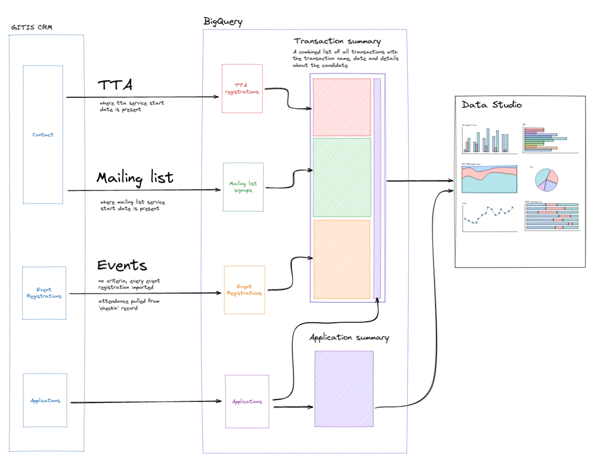

# GIT BigQuery objects

These views transform the raw data from Dynamics into a format that is easily consumed by Google Data Studio.

We do as much of the preparation and joining as possible up front. This includes 
* adding `case` statements to classify some fields
* adding indicators that tell us if a contact has made an application, attended an event, etc
* pulling in common filterable values like subject and degree stage from `profile`

Because we do this joining up front removes the need for [blending](https://support.google.com/datastudio/answer/9061420?hl=en) data and other complex manipulation later on in Data Studio.

There is one summary for each lens that we want to interrogate the data through. Currently they are from the point of view of a transaction and application.

## Transaction summary

Transaction summary brings together the contents of `event_registrations`, `mailing_list_subscriptions` and `teacher_training_adviser_signups` into a single list where the `transaction` column identifies the type.

Things to note:

* there is one row per transaction
* a contact might appear many times (mailing list, TTA and several events)

## Application summary

Application summary provides an overview from an application's point of view. There is one row per application along with:

* all the fields from `applications`
* all the fields from `profile`
* the marketing year (runs from September 1st until August 31st of the following year)
* flags for whether the person has:
  * completed a transaction
  * subscribed to the mailing list
  * registered for an event
  * attended an event
  * signed up for a TTA
  * been assigned a TTA
  * made any successful transaction (including this one)
* their education phase
