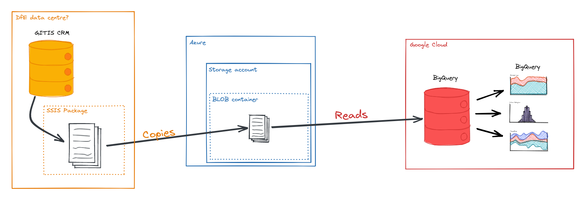

# Connecting BigQuery to Azure Blob Storage via BigQuery Omni

Google recently released [BigQuery Omni][bqomni], a tool that:

> lets you cost-effectively access and securely analyze data across Google
> Cloud, Amazon Web Services (AWS), and Azure (coming soon), without leaving
> the familiar BigQuery user interface (UI)

This could be the best solution for making our GITIS CRM data available in
BigQuery. We wouldn't need to manually copy any files or use third-party tools, instead
we'd need to:

1. Create a secure Azure Storage account and a container within
2. Create an [SSIS package][ssis] that exports the the `git`-prefixed views
   from SQL Server to CSV files
3. Use the [Azure Feature Pack for Integration Services][ssis-to-az] to push the
   CSV files into the Azure Storage container.
4. Connect BigQuery to the Azure Storage Container
   1. In BigQuery, click <kbd>+ ADD DATA</kbd>
   2. Select 'External Data Source'
   3. Choose 'BigLake on Azure (via BigQuery Omni)' from the list of connection types
   4. Add the relevant settings and connect. **These instructions should work
      but we were unable to test because at the moment (2022-06-24) the
      'Connection location' is restricted to `azure-eastus2` and the resource
      creation policy in DfE's Azure setup restricts us to 'azure-uksouth'.**

Notes:

* you can find the azure tenant ID from portal.azure.com by going to Home -> Tenant Properties; alternatively you can use the [az][az] command line tool to run `az account tenant list`
* the storage path should be in the format `azure://bqomnitest.blob.core.windows.net/newcontainer`, where `bqomnitest` is the name of your storage account and `newcontainer` is the name of your container

[bqomni]: https://cloud.google.com/blog/products/data-analytics/introducing-bigquery-omni
[ssis-to-az]: https://docs.microsoft.com/en-us/azure/architecture/data-science-process/move-data-to-azure-blob-using-ssis
[ssis]: https://docs.microsoft.com/en-us/sql/integration-services/sql-server-integration-services?view=sql-server-ver16
[az]: https://docs.microsoft.com/en-us/cli/azure/
