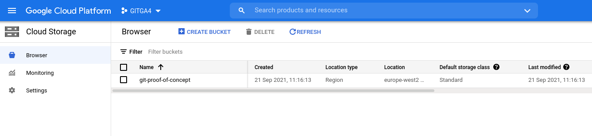
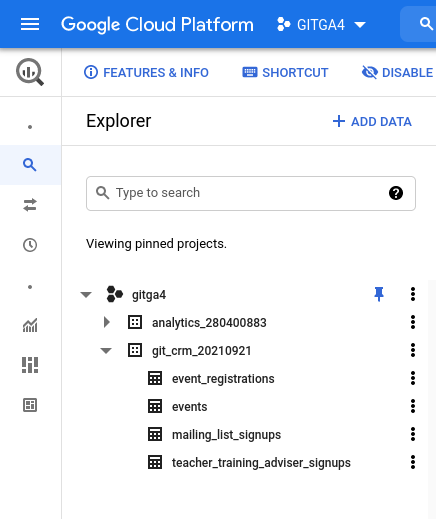
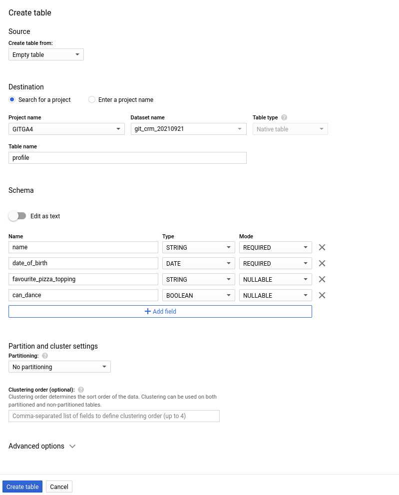
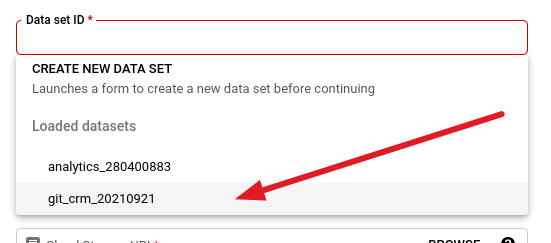
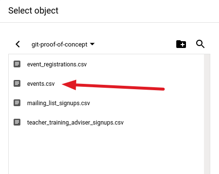
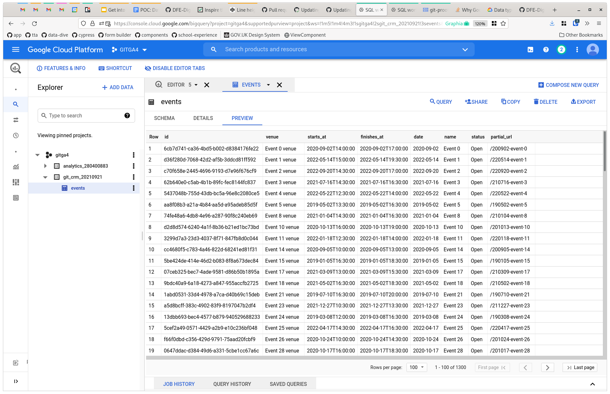

# Importing CSV files to BigQuery


## Overview

This is a brief run-through of the The proof of concept manual process (22nd September 2021)

We are assuming that content from [the views][1] created to pull data on mailing list sign-ups, TTA sign-ups and event sign-ups has been exported in CSV format and the haven't been altered.

For the time being, instead of using actual data from the CRM we're using some dummy data [generated in the same format][2].

## Uploading the CSV files to Google Cloud

This is the first step, we'll need to reference these files in the following stages.

First, create a storage bucket by navigating to the Cloud Storage section of the BigQuery control panel and clicking 'Create bucket'. We just followed the default settings here except for selecting the location `europe-west2 (London)`.



As you can see, our bucket is imaginatively called `git-proof-of-concept`.

## Creating our dataset

The [dataset][4] is a _section_ of our BigQuery workspace. In database lingo it'd be at the [schema][5] level, it's a place where we can put our related tables -- in this case, related by the fact they all come from the CRM.

To create a new dataset, click the three dots next to the project in the sidebar and select 'Create dataset'.


Now we can configure it. In this case we left everything as default except for setting the location to `London (europe-west2)` (yes, the same option as above but reversed!) and naming it `git_crm`. BigQuery adds a date to the end of the name so our dataset is now called `git_crm_20210921`.

## Creating the tables in BigQuery

Now we have a fresh project with some raw CSV files and an empty dataset, we're ready to start bringing them together into tables that we can query.

Navigating to the [SQL Workspace][3] will give us a sidebar that looks like this:

.

This screenshot shows the tables we'll be creating, but for now we want to 'Create table'.

In the configuration panel that appears we want to create from an empty table



Here we want to mimic the format in the CSV files as closely as possible and create one table per file we want to import.

## Importing the data

This is the tricky bit, it took a couple of goes to make this run smoothly, mainly due to inconsistencies between our random data generator and the format expected by BigQuery.

In the BigQuery sidebar, pick 'Data transfers' and then click 'Create transfer'. BigQuery will prompt you for a source, we want to choose one of our CSV files from our bucket. For this example we'll use `events.csv`.

| Choose our dataset                                         | Choose our CSV                                         |
| ------------------                                         | --------------                                         |
|  | 

### Other important settings

Most of the settings here are self-explanatory but these ones are worth paying extra attention to.

| Setting             | What we chose | Why we chose it                                                                  |
| -------             | ------------- | ---------------                                                                  |
| Write preference    | `MIRROR`      | Our views select **all data** every time they run, we want to overwrite          |
| Header rows to skip | `1`           | The CSV files have a single header row, the import will fail unless it's ignored |
| Repeats             | On demand     | In this proof-of-concept we want to run it ad hoc.                               |

Once we've created finished setting up our transfer and clicked 'Save', it should start automatically. If everything goes smoothly, well done! 🎉 Go and make a cup of tea.

If it didn't -- and it certainly didn't for us at first -- review the errors, amend the table or CSV accordingly and retry.

An example error we encountered was:

```
Error while reading data, error message:
  Could not parse '2021-05-14 15:48:00' as DATE for field date (position 4)
  starting at location 76 with message 'Unable to parse'; JobID:
  275553675734:bqts_61466a87-0000-2b1d-ac9a-f403045f7206 
```

This is simply a result of us trying to put a `datetime` into a `date` field.

Once the import is done you can check everything looks sensible and things are correctly-mapped.



## Lessons learnt and things improve next time

* BigQuery supports a [boolean datatype][6], the views should return `true` and `false` instead of `yes` and `no`.
* There's an option to create tables directly from the CSV. It might be worth exploring providing it makes the right judgements about fieldtypes

## Things that need some more research

* Unlike PostgreSQL, there's no [`uuid` datatype][7]. We just set them as `STRING` for the time being, perhaps there's a better alternative.


[1]: /DFE-Digital/get-into-teaching-data-dive/tree/main/views
[2]: /DFE-Digital/get-into-teaching-data-dive/blob/main/scripts/generate_sample_data.rb
[3]: https://cloud.google.com/bigquery/docs/bigquery-web-ui
[4]: https://cloud.google.com/bigquery/docs/datasets-intro
[5]: https://en.wikipedia.org/wiki/Database_schema
[6]: https://cloud.google.com/bigquery/docs/reference/standard-sql/data-types#boolean_type
[7]: https://en.wikipedia.org/wiki/Universally_unique_identifier
