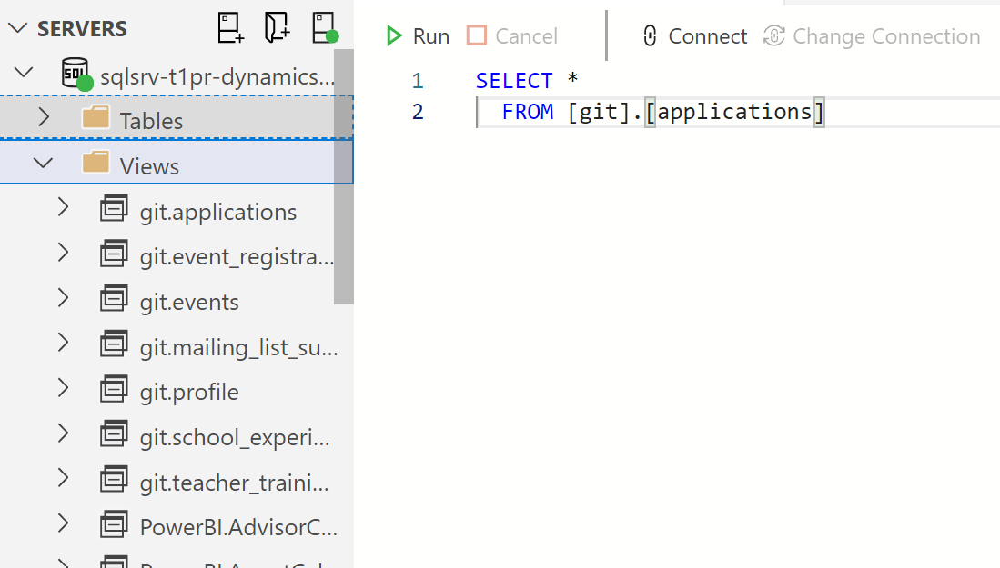

# Manual imports

Currently we're stuck doing manual imports of data to BigQuery because the
KingswaySoft adapter:

* doesn't quite work correctly (it renders connected Data Studio reports
  unusable for some time after it runs)
* it cannot be automated

The goal is to export the [seven views in the `git` schema](/DFE-Digital/get-into-teaching-crm-exports/tree/main/dynamics) to
CSV files and upload them to Google Cloud Storage.

.

* `git.applications`
* `git.event_registrations`
* `git.events`
* `git.mailing_list_subscriptions`
* `git.profile`
* `git.school_experience_requests`
* `git.teacher_training_adviser_signups`

## Steps

1. Connect to SQL Server from [Azure Data Studio](https://docs.microsoft.com/en-us/sql/azure-data-studio/download-azure-data-studio?view=sql-server-ver16) or [SQL Server Management Studio](https://docs.microsoft.com/en-us/sql/ssms/download-sql-server-management-studio-ssms?view=sql-server-ver16)
2. Expand the 'Views' list in the object tree. The `git` schema views should be
   at the top
3. In an SQL query editor, for each of the views listed above type
   `select * from [view name];` and run the query
4. When the query has run click the 'Save as CSV' button in Azure Data Studio
   or right click and select 'Save Results As...' in SSMS. Save them to a file
   that matches the view name without the `git.` prefix (eg. `applications.csv`,
   `event_registations.csv`)
5. Google BigQuery doesn't accept the text `NULL` for null values and Azure doesn't
   have a setting to disable it (SSMS might), so we need to do a quick find and
   replace to get rid of them. Open each file in Notepad, press `<ctrl+h>` to open the
   'Replace' dialogue, set 'Find what' to `NULL` and leave 'Replace with' empty, then
   press 'Replace All' (`<alt+a`). Using the keyboard shortcuts shortens this process
   significantly, all the files can be updated in about 20 seconds.
6. Now we can upload the CSVs to Google Cloud Storage. Because we're doing it from
   a DfE machine and can't install the Google Cloud SDK I do this manually. Open
   [the Google Cloud Console](https://console.cloud.google.com/), ensure the
   project is set to 'Get Into Teaching', click 'Storage' and navigate to
   `git-transactions`. Now we can drag the CSV files from our computer to the
   Cloud. When prompted select 'replace' for all of them.
7. Now we can do the actual import to BigQuery. Open BigQuery and navigate to 'Transfers'.
   Then click each of the transfers and click 'Run transfer now'.
8. All done, time for a cup of tea
